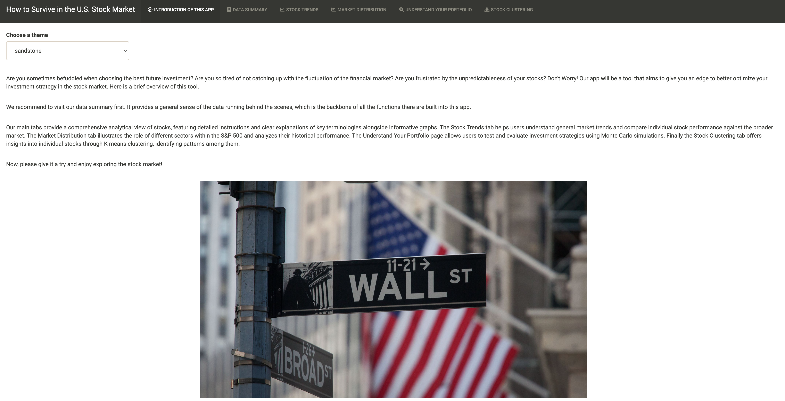

# project4-london-fog

Team: London Fog

Team members: Angela Zhao, Zheng Ren, Yuzi Li, Yicheng Shen

Our main data analytic product, a shiny app, has also been deployed: https://zren0723.shinyapps.io/project4-london-fog/

A write-up of this final project is also included in this repo, with the file name `Final Project Write-up`. 

## Overview

The project aims to provide beginner investors with an accessible, interactive tool to better understand stock market performance and optimize their investment strategies. 
Our team developed this Shiny app that combines real-time stock data, portfolio analysis, and statistical prediction to address the limitations of existing tools, such as high costs (Bloomberg Terminal) and lack of predictive features (free alternatives like stocktracker).

## Key Features of the Project:

**User-Friendly Interface**: The app is designed for ease of use, with interactive visualizations tailored to the needs of retail investors.

**Stock Market Insights**: Users can compare stock trends, analyze market performance, and track portfolios using historical data.

**Portfolio Prediction**: Monte Carlo simulations are integrated to predict future portfolio performance based on user inputs.

**Stock Clustering**: K-means clustering groups stocks based on return and volatility, providing insights into stock behavior.

## Data and Tools:

Our data source is from Yahoo Finance database (accessed via `tidyquant` package).

### Programing Paradigms:

-   Functional programming for efficient data handling.

-   Machine learning (K-means clustering) for stock groupings.

-   Monte Carlo simulations for predictive analytics.

## Shiny App Structure

-   **Introduction to the app:** General introduction to the app, customize the theme
-   **Data summary:** General information about the stock market in a tabular format
-   **Stock trends:** Stock Comparison
-   **Market Distribution:** Market performance based on the S&P 500 and its sectors
-   **Understand your portfolio:** Customized portfolio performance using historical data and predictions through Monte Carlo simulations
-   **Stock clustering:** S&P 500 stock clusters based on return and volatility

